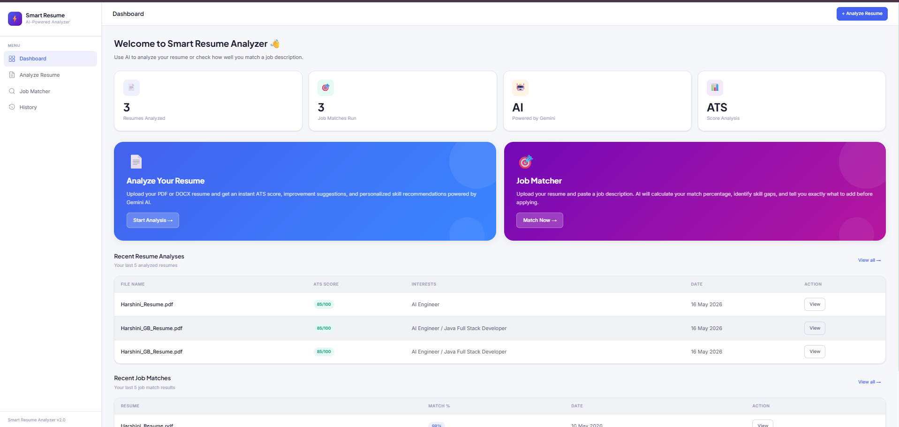
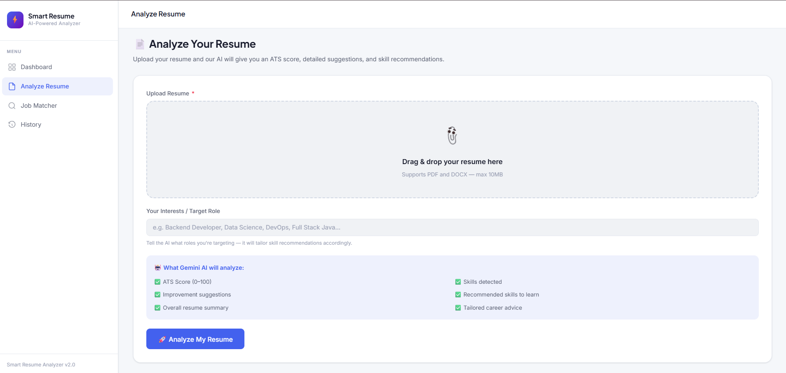
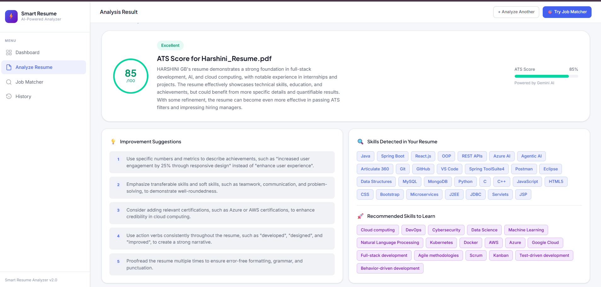
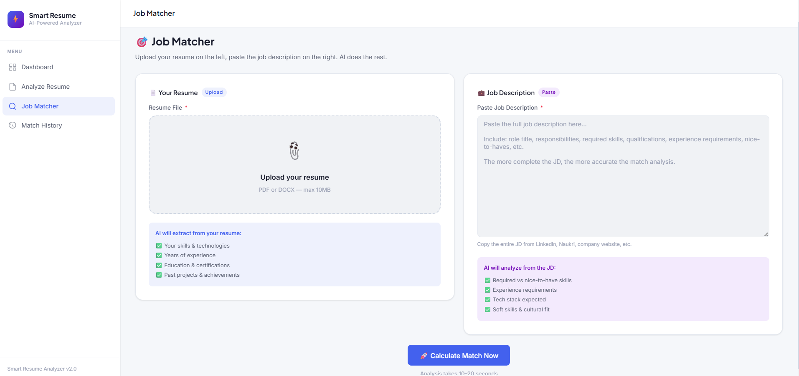
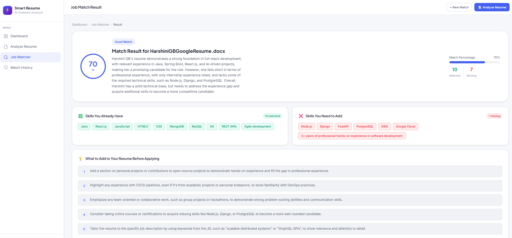

# Smart Resume Analyzer & Job Matcher

An AI-powered web application built with **Spring Boot** and **Groq AI (LLaMA 3.3)** that analyzes resumes and matches them against job descriptions.

## Features

- Upload PDF or DOCX resume
- Get instant ATS Score (0-100)
- AI-powered improvement suggestions
- Skill recommendations based on interests
- Job Matcher — compare resume vs job description
- Match percentage with missing skills analysis
- History of all past analyses

## Tech Stack

| Layer | Technology |
|---|---|
| Backend | Java 17, Spring Boot 3.2 |
| UI | Thymeleaf, HTML, CSS |
| AI | Groq API (LLaMA 3.3 70B) |
| Database | MySQL |
| ORM | Spring Data JPA + Hibernate |
| PDF Parsing | Apache PDFBox 3.0 |
| DOCX Parsing | Apache POI 5.2 |
| Build Tool | Maven |
| IDE | Spring Tool Suite 4 |

## Screenshots

### Dashboard

### Resume Analyzer

### Resume Result

### Job Matcher

### Job Match Result

## Setup Instructions

1. Clone the repository
2. Copy `application-example.properties` to `application.properties`
3. Fill in your MySQL credentials and Groq API key
4. Run `./mvnw spring-boot:run`
5. Open `http://localhost:8080`

## Get Groq API Key (Free)

1. Go to https://console.groq.com/keys
2. Sign in with Google
3. Create API Key
4. Paste in `application.properties`

